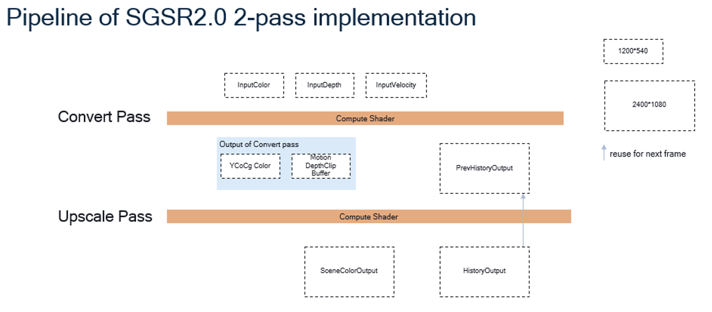

# Implement

# Show
upscale:1

upscale:2

upscale:0.294

# Reference
- https://github.com/SnapdragonStudios/snapdragon-gsr
- [Snapdragon™ Game Super Resolution-移动端的超分辨技术](https://zhuanlan.zhihu.com/p/13948478775)
- [SGSR2（超分） URP下落地实装](https://zhuanlan.zhihu.com/p/8980985121)